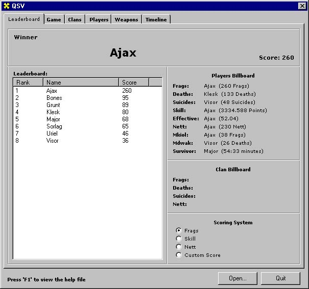



## QSV  \(Quake Stats Viewer\) v1\.0

### Description

Finally! The complete Quake Stats Viewer. Extracts all the information you can think of from your Quake generated logs. This program is brilliant for use at lan games, or whatever.

This program (literally) rips out all the information I could think of. Even generates a relative skill level of all the players in a game! This, I truly believe, is a must-see.

I have included a small sample log file, for those of you that don't have Quake, or access to log files.
 
### More Info
 
Quake generated log file.

The code is well commented. If you get stuck, I have included my contact address in the upload.

All the statistical information you can think of!

None (I know of)

             |
---                |---
**Submitted On**   |2001-06-04 08:55:48
**By**             |[Andreas Laubscher](https://github.com/Planet-Source-Code/PSCIndex/blob/master/ByAuthor/andreas-laubscher.md)
**Level**          |Intermediate
**User Rating**    |5.0 (25 globes from 5 users)
**Compatibility**  |VB 5\.0, VB 6\.0
**Category**       |[Games](https://github.com/Planet-Source-Code/PSCIndex/blob/master/ByCategory/games__1-38.md)
**World**          |[Visual Basic](https://github.com/Planet-Source-Code/PSCIndex/blob/master/ByWorld/visual-basic.md)
**Archive File**   |[QSV  versi20553642001\.zip](https://github.com/Planet-Source-Code/andreas-laubscher-qsv-quake-stats-viewer-v1-0__1-23752/archive/master.zip)

### API Declarations

None(!)

